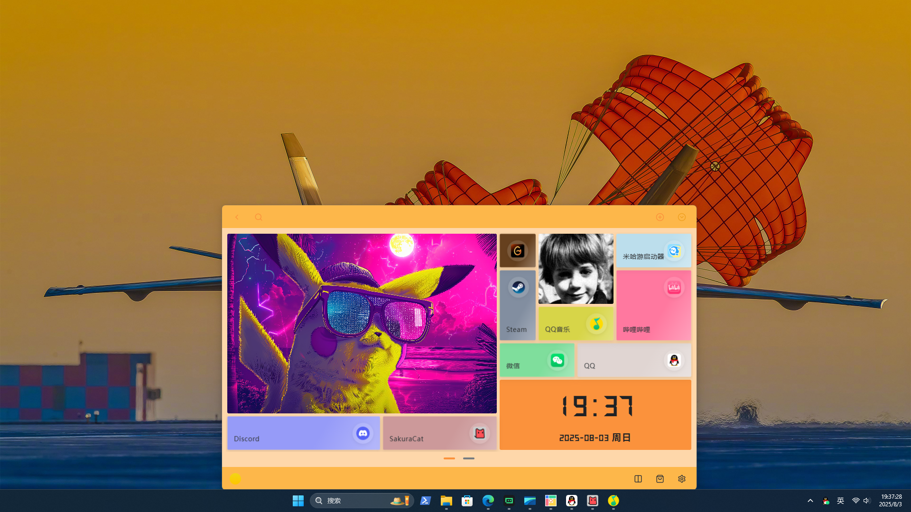
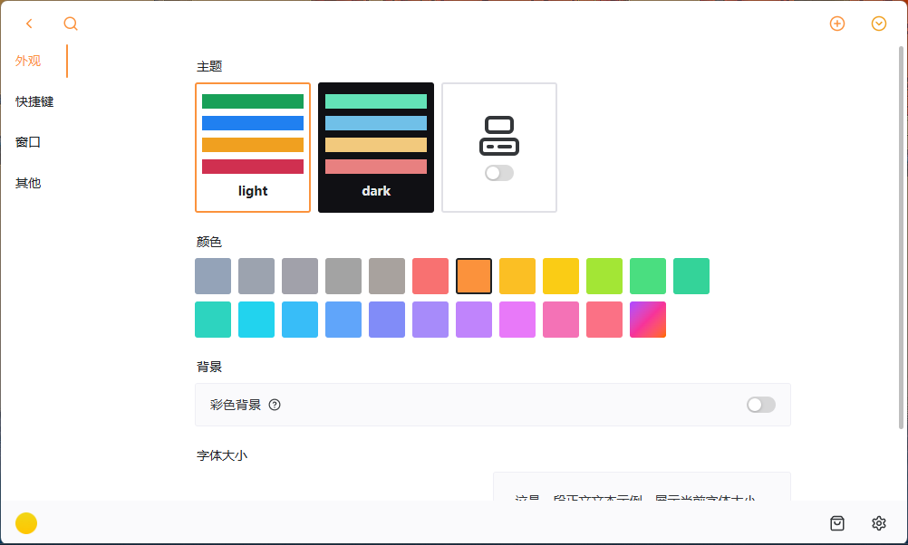
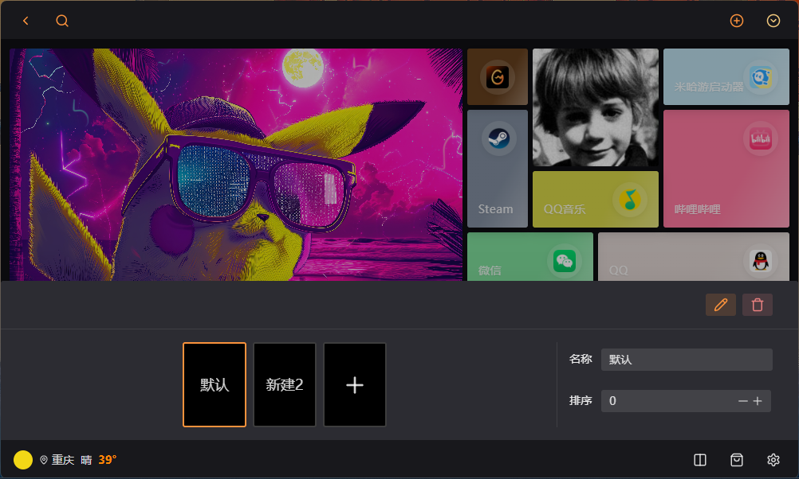

# Pegboard

[中文版本](README_CN.md) | English Version

## Project Introduction
Pegboard is a customizable desktop widget application based on Tauri + Vue 3, allowing you to create and organize various useful widgets on your desktop.

## Features
- **Customizable Widget Board**: Add, move, and resize various widgets
- **Built-in Widgets**: Clock, image viewer, etc.
- **Application Launcher**: Quick launch your frequently used applications
- **Drag and Drop**: Easily adjust widget positions and sizes
- **Global Shortcut**: Use `Control+Alt+Space` to quickly show/hide the application
- **Theme Switching**: Support light and dark themes
- **System Tray Integration**: Stay in the system tray when minimized
- **Auto-update**: Support automatic application updates

## Screenshots




## Installation Instructions
### Install from Release
1. Visit the [GitHub Releases](https://github.com/peachMMZ/pegboard/releases) page
2. Download the installation package suitable for your operating system
3. Run the installer and follow the prompts

### Build from Source
#### Prerequisites
- Install [Node.js](https://nodejs.org/)
- Install [Rust](https://www.rust-lang.org/)
- Install [Tauri CLI](https://tauri.app/v1/guides/getting-started/prerequisites/)

#### Environment Variables Configuration
1. Create a `.env.local` file in the project root directory
2. Copy the contents from `.env.example` and replace the placeholder values with your actual API keys and configuration
3. For local development, the application will automatically read these variables
4. For GitHub Actions builds, set the corresponding secrets in your repository settings:
   - `VITE_WEATHER_API_KEY`

#### Build Steps
```bash
# Clone the repository
# git clone https://github.com/peachMMZ/pegboard.git
# cd pegboard

# Install dependencies
yarn install

# Run in development mode
yarn run tauri dev

# Build production version
yarn run tauri build
```

## Usage
### Basic Operations
1. After launching the application, the application window will appear at the bottom of the desktop
2. Use the global shortcut `Control+Alt+Space` to quickly show/hide the window
3. Clicking the system tray icon can also show/hide the window
4. In the application window, you can add, move, and resize widgets

### Adding Widgets
1. Click the "Marketplace" icon in the left menu bar
2. Browse available widgets (built-in, official, and community)
3. Click a widget to add it to the current board

### Customizing Widgets
1. Click the edit button in the upper right corner of the widget
2. Adjust the settings according to the widget type
3. Click the save button to apply changes

### Switching Themes
1. Click the "Settings" icon in the left menu bar
2. Select "Light" or "Dark" theme in the theme settings
3. You can also choose "Follow System Theme"

## Technology Stack
- **Frontend**: Vue 3 + TypeScript + Tailwind CSS
- **State Management**: Pinia
- **UI Component Library**: Naive UI
- **Desktop Framework**: Tauri
- **Backend**: Rust

## Project Structure
```
pegboard/
├── .editorconfig
├── .env.local
├── .gitignore
├── .prettierrc
├── README.md
├── README_CN.md
├── index.html
├── package.json
├── preview/
│   ├── pegboard_preview_1.png
│   ├── pegboard_preview_2.png
│   └── pegboard_preview_3.png
├── public/
│   ├── icon/
│   └── image/
├── src/
│   ├── App.vue
│   ├── assets/
│   ├── components/
│   ├── layout/
│   ├── main.css
│   ├── main.ts
│   ├── router/
│   ├── setup/
│   ├── store/
│   ├── utils/
│   ├── views/
│   ├── vite-env.d.ts
│   └── widgets/
├── src-tauri/
│   ├── .gitignore
│   ├── Cargo.toml
│   ├── build.rs
│   ├── capabilities/
│   ├── gen/
│   ├── icons/
│   ├── src/
│   ├── target/
│   └── tauri.conf.json
├── tsconfig.json
├── tsconfig.node.json
└── vite.config.ts
```

## Contribution Guidelines
1. Fork this repository
2. Create your feature branch (`git checkout -b feature/AmazingFeature`)
3. Commit your changes (`git commit -m 'Add some AmazingFeature'`)
4. Push to the branch (`git push origin feature/AmazingFeature`)
5. Open a Pull Request

## License
This project is licensed under the [MIT License](LICENSE).

## Contact the Author
- Email: horselm@outlook.com

## Acknowledgements
This README file was generated with the assistance of AI.
