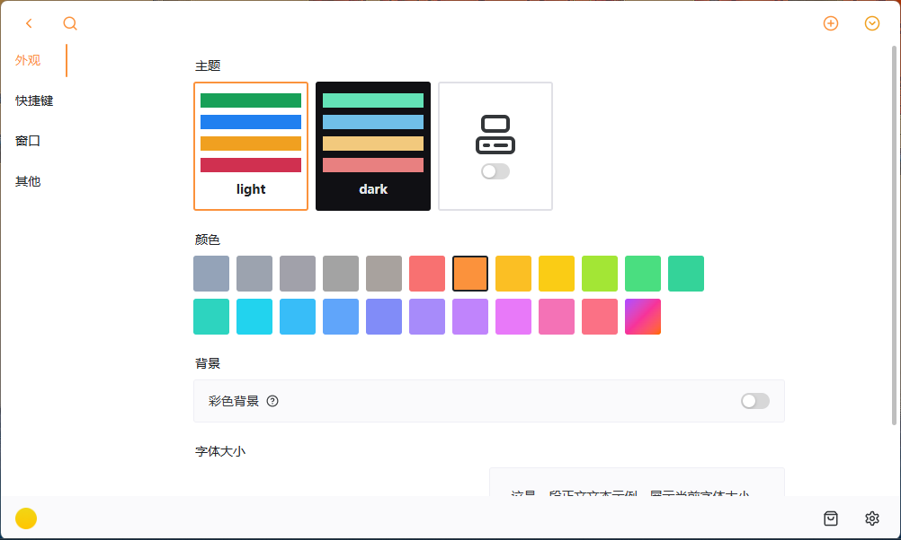

# Pegboard

[English Version](README.md) | 中文版本

## 项目简介
Pegboard 是一个基于 Tauri + Vue 3 的可定制桌面挂件应用，让你可以在桌面上创建和组织各种实用的小部件。

## 功能特点
- **可定制的挂件板**：添加、移动和调整各种小部件的大小
- **内置小部件**：时钟、图片查看器等
- **应用启动器**：快速启动你常用的应用程序
- **拖拽功能**：轻松调整小部件位置和大小
- **全局快捷键**：使用 `Control+Alt+Space` 快速显示/隐藏应用
- **主题切换**：支持亮色和暗色主题
- **系统托盘集成**：最小化时保持在系统托盘中
- **自动更新**：支持应用自动更新

## 应用截图




## 安装说明
### 从发布版本安装
1. 访问 [GitHub Releases](https://github.com/peachMMZ/pegboard/releases) 页面
2. 下载适合你操作系统的安装包
3. 运行安装程序并按照提示进行安装

### 从源码构建
#### 前提条件
- 安装 [Node.js](https://nodejs.org/)
- 安装 [Rust](https://www.rust-lang.org/)
- 安装 [Tauri CLI](https://tauri.app/v1/guides/getting-started/prerequisites/)

#### 环境变量配置
1. 在项目根目录创建 `.env.local` 文件
2. 复制 `.env.example` 中的内容，并将占位符值替换为你的实际 API 密钥和配置
3. 对于本地开发，应用程序将自动读取这些变量
4. 对于 GitHub Actions 构建，在你的仓库设置中设置相应的 secrets：
   - `VITE_WEATHER_API_KEY`

#### 构建步骤
```bash
# 克隆仓库
# git clone https://github.com/peachMMZ/pegboard.git
# cd pegboard

# 安装依赖
yarn install

# 开发模式运行
yarn run tauri dev

# 构建生产版本
yarn run tauri build
```

## 使用方法
### 基本操作
1. 启动应用后，会在桌面底部显示应用窗口
2. 使用全局快捷键 `Control+Alt+Space` 可以快速显示/隐藏窗口
3. 点击系统托盘图标也可以显示/隐藏窗口
4. 在应用窗口中，你可以添加、移动和调整小部件

### 添加小部件
1. 点击左侧菜单栏中的 "应用市场" 图标
2. 浏览可用的小部件（内置、官方和社区）
3. 点击小部件将其添加到当前面板

### 自定义小部件
1. 点击小部件右上角的编辑按钮
2. 根据小部件类型，调整相关设置
3. 点击保存按钮应用更改

### 切换主题
1. 点击左侧菜单栏中的 "设置" 图标
2. 在主题设置中选择 "亮色" 或 "暗色" 主题
3. 也可以选择 "跟随系统主题"

## 技术栈
- **前端**：Vue 3 + TypeScript + Tailwind CSS
- **状态管理**：Pinia
- **UI组件库**：Naive UI
- **桌面框架**：Tauri
- **后端**：Rust

## 项目结构
```
pegboard/
├── .editorconfig
├── .env.local
├── .gitignore
├── .prettierrc
├── README.md
├── README_CN.md
├── index.html
├── package.json
├── preview/
│   ├── pegboard_preview_1.png
│   ├── pegboard_preview_2.png
│   └── pegboard_preview_3.png
├── public/
│   ├── icon/
│   └── image/
├── src/
│   ├── App.vue
│   ├── assets/
│   ├── components/
│   ├── layout/
│   ├── main.css
│   ├── main.ts
│   ├── router/
│   ├── setup/
│   ├── store/
│   ├── utils/
│   ├── views/
│   ├── vite-env.d.ts
│   └── widgets/
├── src-tauri/
│   ├── .gitignore
│   ├── Cargo.toml
│   ├── build.rs
│   ├── capabilities/
│   ├── gen/
│   ├── icons/
│   ├── src/
│   ├── target/
│   └── tauri.conf.json
├── tsconfig.json
├── tsconfig.node.json
└── vite.config.ts
```

## 贡献指南
1. Fork 本仓库
2. 创建你的特性分支 (`git checkout -b feature/AmazingFeature`)
3. 提交你的更改 (`git commit -m 'Add some AmazingFeature'`)
4. 推送到分支 (`git push origin feature/AmazingFeature`)
5. 打开一个 Pull Request

## 许可证
本项目采用 [MIT 许可证](LICENSE)。

## 联系作者
- Email: horselm@outlook.com

## 注意事项
本README文件是在AI的协助下生成的。使用前请仔细审查和验证信息。